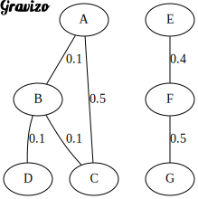

# CSE 100 - Advanced Data Structures and Algorithms

## Project 2 - Graphs

### Overview

Graphs are a fundamental concept in Computer Science and can be used to represent a wide range of systems involving connected components. In this project, we implemented a graph data structure and associated algorithms to analyze network structures, such as those used in epidemiology.

For instance, in the field of HIV and COVID-19 research, a tool called HIV-TRACE (Pond et al., 2018) is used to study virus transmission by constructing a graph from genetic sequence data. Given `n` viral sequences, the tool performs the following:

- Constructs an empty graph with `n` nodes (one per sequence).
- Computes the pairwise distance between sequences under the TN93 model of DNA evolution (Tamura & Nei, 1993).
- Connects nodes `u` and `v` with an undirected edge if their distance is ≤ 0.015.
- Uses the connected components of the resulting graph to define "transmission clusters".

These graphs can provide valuable insights for public health efforts beyond identifying clusters (Grabowski et al., 2018).

### Project Description

We implemented an undirected `Graph` class and tested its functionality using a suite of algorithms. The project involved working with a set of starter files and example datasets.

### Files and Functionality

#### `Graph.h`

This header file defined the interface of the `Graph` class. We were responsible for implementing the required function declarations. While we were allowed to add instance variables and helper functions, we preserved the original function signatures.

#### `Graph.cpp`

This file contained the skeleton implementations for the functions declared in `Graph.h`. We implemented the logic for graph construction, traversal, shortest paths, and component analysis.

#### `GraphTest.cpp`

This file served as a test driver to validate our implementation. The resulting executable can be run as:

```
./GraphTest <edgelist_csv> <test>
```

- `<edgelist_csv>`: The filename of a CSV representing the undirected graph.
- `<test>`: The name of the test to run (explained below).

#### Edge List Format

Graphs were provided in CSV format where each line represents an undirected edge:

```
u,v,w
```

For Example, for the following graph:



We could represent it using the following edge list CSV (note that the order of the rows is arbitrary):

```
A,B,0.1
A,C,0.5
B,C,0.1
B,D,0.1
E,F,0.4
F,G,0.5
```

This format represents a graph with edges and weights between nodes. We ensured that:

- Edge weights were non-negative.
- No self-edges existed (e.g., `u,u,w`).
- No duplicate or reversed edges existed (e.g., if `u,v,w` appears, then `v,u,w` will not).
- Edges were not guaranteed to be in any specific order.

#### Test Types

The `<test>` argument in `GraphTest` supports the following values:

- `graph_properties`: Tests basic graph creation and property validation.
- `shortest_unweighted`: Tests the unweighted shortest path algorithm.
- `shortest_weighted`: Tests the weighted shortest path algorithm.
- `connected_components`: Tests the detection of connected components.
- `smallest_threshold`: Tests for computing the smallest edge weight threshold to connect two nodes.

We reviewed the test logic in `GraphTest.cpp` to understand expected behavior and ensure correctness.

#### `Makefile`

We used the provided `Makefile` to compile the project. Running:

```
make
```

produced the `GraphTest` executable. We were free to add additional files, as long as the original version of `GraphTest.cpp` remained compilable using `make`.

## Example Graph Files

The `example` directory included:

- `small.csv`: A small example graph matching the illustration from the README.
- `hiv.csv`: A real-world dataset derived from HIV-TRACE analysis (Little et al., 2014).

## Summary

This project gave us hands-on experience implementing graph structures and algorithms to analyze real-world network data. From shortest path computations to transmission clustering, we explored a range of core graph functionalities using a custom-built C++ class.